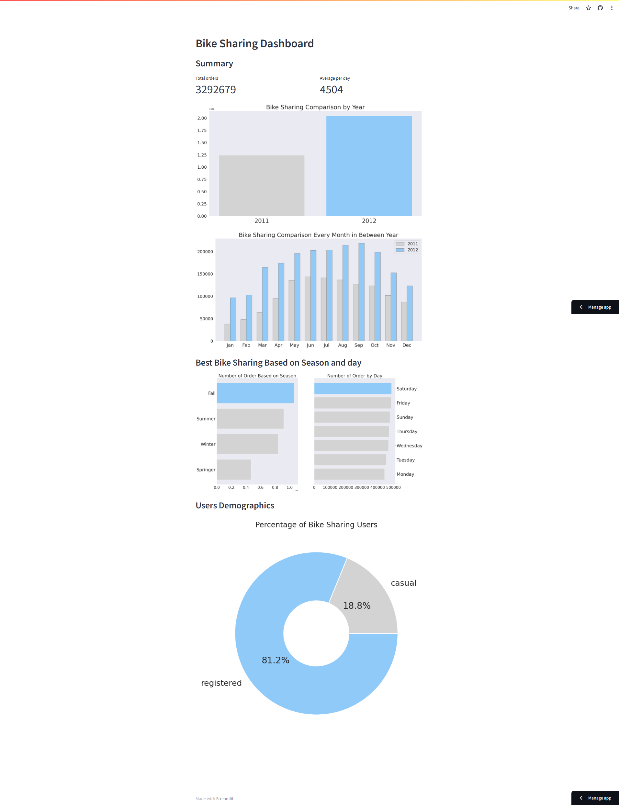

# Proyek Analisis Data: Bike Sharing Dataset
- Nama: Fery Irawan
- Email: fery21irawan.me@gmail.com
- Id Dicoding: mazafathi
- Dataset Source : [Source Link](https://drive.google.com/file/d/1RaBmV6Q6FYWU4HWZs80Suqd7KQC34diQ/view)

## Setup for Jupyter Notebook

### Setup environment
**Install pipenv**
```
pip install --user pipenv
```
**Install dependency**
```
pipenv install numpy pandas matplotlib seaborn jupyter
```
**Run pipenv shell**
```
pipenv shell
```

### Run Jupyter Notebook
```
jupyter notebook .
```

## Setup steamlit app

### Install dependency
```
pip install -r requirements.txt
```

### Run Streamlit App 
```
streamlit run dashboard/dashboard.py
```

**This app can also be accessed at url https://bike-sharing-analysis-slwfmxdkckk2xx739nh4kr.streamlit.app/**

### Screenshot
